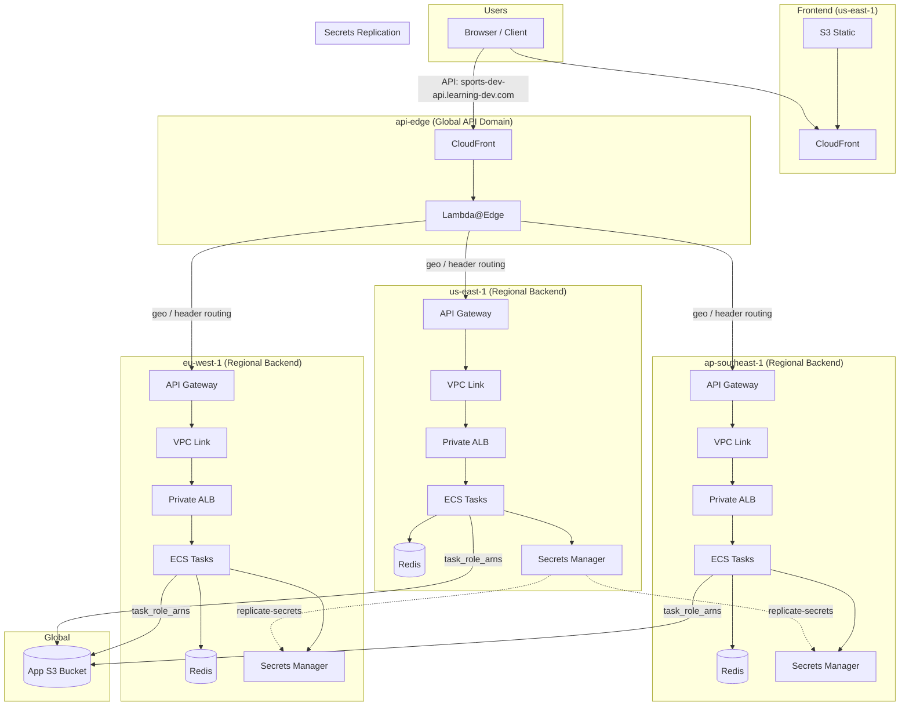

# Multi-Region (Single Global API Domain)

This guide sets up **three regional backends** behind **one global API domain**
using a **single CloudFront distribution** with multi-origin routing.

## Architecture diagram



**Legend:**
- **Frontend** – Single region (us-east-1); S3 + CloudFront; `VITE_API_URL` points to the global API domain.
- **api-edge** – Global CloudFront + Lambda@Edge; single API domain; routes requests to regional API Gateways based on `geo_routing_map` or `origin_routing_header`.
- **Regional Backend** – Per region: API Gateway → VPC Link → Private ALB → ECS tasks (`cloudfront_enabled = false`); each region has its own Redis and Secrets Manager.
- **App S3 Bucket** – Global; grants access via `task_role_arns` from all three regional backends.
- **Secrets Replication** – `replicate-secrets.yml` syncs secrets from source region to others.

## Architecture used by this guide

- Regional `ecs-backend` in `us-east-1`, `eu-west-1`, `ap-southeast-1`
- **Regional Redis per region** (created by each `ecs-backend` stack)
- Global API domain via `api-edge` (`CloudFront + Lambda@Edge`)
- Global app bucket policy via `app-bucket`
- Frontend in `us-east-1`

Important:
- `redis-global` is removed from this architecture.
- `redis_endpoint_override` is not used.

## When to use this

- You want one API domain (for example `sports-dev-api.learning-dev.com`)
- You want edge-based region routing with one CloudFront API distribution
- You want low-latency, write-capable Redis cache per region

## Prerequisites

- Terraform 1.13+
- AWS CLI configured
- Route53 hosted zone for your domains
- ACM certificate in `us-east-1` for API CloudFront domain
- Existing global app bucket (`app_s3_bucket_name`)

## Global prerequisites (one-time)

1) Create global app bucket
2) Create CloudFront logs bucket
3) Create IAM OIDC role for GitHub Actions (per environment)
4) Set GitHub Environment secrets (per env):
   - `STATE_BUCKET`, `STATE_DDB_TABLE`, `APP_PREFIX`, `ROLE_ARN`
   - `TFVARS_ECS_BACKEND_US_EAST_1`, `TFVARS_ECS_BACKEND_EU_WEST_1`, `TFVARS_ECS_BACKEND_AP_SOUTHEAST_1`
   - `TFVARS_FRONTEND`
   - `TFVARS_API_EDGE`
   - `TFVARS_APP_BUCKET`
5) Workflow notes:
   - Terraform state region is fixed to `us-east-1` in workflows.
   - `ROLE_ARN` is read from GitHub Environment secrets.

## Dependency graph (output flow)

```text
ecs-backend/us-east-1  --(api_gateway_endpoint)--> api-edge
ecs-backend/eu-west-1  --(api_gateway_endpoint)--> api-edge
ecs-backend/ap-southeast-1 --(api_gateway_endpoint)--> api-edge

ecs-backend/us-east-1  --(task_role_arns)--> app-bucket
ecs-backend/eu-west-1  --(task_role_arns)--> app-bucket
ecs-backend/ap-southeast-1 --(task_role_arns)--> app-bucket
```

## Step 1: Regional backend (repeat per region)

For each region: `us-east-1`, `eu-west-1`, `ap-southeast-1`

1) Configure tfvars from `infra/aws/ecs-backend/tfvars/<env>.tfvars.example`
   - Use the example file as the source of truth for all variables.
   - Refer to `infra/aws/ecs-backend/README.md` for variable details.
2) Keep `cloudfront_enabled = false` (global edge mode)
3) Apply `terraform-ecs-backend.yml` with `action=apply`
4) Collect outputs:
   - `api_gateway_endpoint` (for `api-edge`)
   - `task_role_arns` (for `app-bucket`)
5) Deploy backend services (`build-deploy-ecs-backend.yml`) if needed

## Step 1a: Secrets replication (global)

Run `replicate-secrets.yml`:
- after initial backend applies
- after any Secrets Manager changes in source region

This keeps all regional secret values synchronized.

### Redis auth token note

- `redis_auth_token_bootstrap` initializes regional secrets if empty.
- Keep the Redis token value consistent across regions via replication.
- If token value changes:
  1) Update source region secret
  2) Run `replicate-secrets.yml`
  3) Re-apply affected regional `ecs-backend` stacks
  4) Re-deploy/restart ECS services

## Step 2: Global API Edge

1) Apply `terraform-api-edge.yml` in `us-east-1`
2) Provide:
   - Use `infra/aws/api-edge/tfvars/<env>.tfvars.example` as the source of truth.
   - Set `origin_domains` from regional `api_gateway_endpoint` outputs.
   - Refer to `infra/aws/api-edge/README.md` for variable details.
3) Route53 points API domain to global CloudFront distribution
4) Create CloudFront invalidation (recommended after apply):
   1. Open AWS Console → CloudFront
   2. Go to Distributions
   3. Open distribution with alias `sports-dev-api.learning-dev.com` (or your API domain)
   4. Open Invalidation tab
   5. Click Create invalidation
   6. Enter `/*` in Object paths
   7. Click Create invalidation
   8. Wait until status is Completed

Troubleshooting fallback:
- If edge behavior appears stale after apply + invalidation:
  - make a no-op change in `infra/aws/api-edge/lambda/origin-router.js.tmpl`
  - re-apply `terraform-api-edge.yml`
  - invalidate `/*` again

## Step 3: App bucket policy (global)

1) Apply `terraform-app-bucket.yml` with:
   - tfvars based on `infra/aws/app-bucket/tfvars/<env>.tfvars.example`
   - `task_role_arns` from all regional backend outputs
   - Refer to `infra/aws/app-bucket/README.md` for variable details.
2) Confirm ECS tasks can access objects

## Step 4: Frontend (single region)

1) Apply `terraform-frontend.yml` in `us-east-1`
   - Use `infra/aws/frontend/tfvars/<env>.tfvars.example`.
   - Refer to `infra/aws/frontend/README.md` for variable details.
2) Deploy frontend
3) Set `VITE_API_URL = https://sports-dev-api.learning-dev.com`

## Validation checklist

- Requests route to expected region per `geo_routing_map` / routing header.
- Regional backend logs appear in intended region.
- Each region's Redis endpoint is region-local in ECS `REDIS_URL`.
- API returns healthy responses from frontend origin.

## Destroy order

1) Frontend
2) `api-edge`
3) `app-bucket`
4) Regional `ecs-backend`

### Lambda@Edge destroy behavior (important)

- During `api-edge` destroy, Lambda@Edge deletion can fail initially with an error like:
  `InvalidParameterValueException: ... unable to delete ... because it is a replicated function`.
- This is usually expected: CloudFront association removal must propagate globally before Lambda version deletion is allowed.
- Typical timing is 10-30 minutes, but it can take longer.
- Recommended approach:
  1) Let the first destroy complete as far as possible (disassociation step)
  2) Wait for propagation
  3) Re-run destroy for `api-edge`
- In practice this is often a two-pass teardown: pass 1 detaches from CloudFront, pass 2 deletes Lambda@Edge versions.

## Best practice notes

- Keep log buckets separate from app bucket.
- Keep CloudFront + WAF in `us-east-1`.
- Prefer geo routing + default fallback, use header routing for testing.
