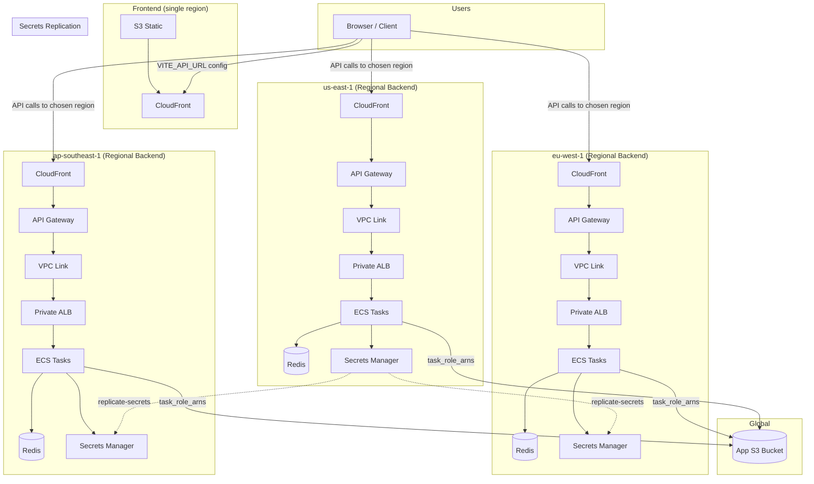

# Multi-Region (Per-Region API Domains)

This guide sets up **three independent regional backends** and a **single frontend**
that targets a **region-specific API domain**. There is **no global API domain**.

## Architecture diagram



**Legend:**
- **Frontend** – Single region; S3 + CloudFront; `VITE_API_URL` points to one regional API domain.
- **Regional Backend** – Per region: CloudFront → API Gateway → VPC Link → Private ALB → ECS tasks; each region has its own Redis and Secrets Manager.
- **App S3 Bucket** – Global; grants access via `task_role_arns` from all three regional backends.
- **Secrets Replication** – `replicate-secrets.yml` syncs secrets from source region to others.

## When to use this
- You want fully independent regional stacks.
- You are okay with the frontend calling a **specific region** (by config).
- You do **not** need a single global API domain.

## Prerequisites
- Terraform 1.13+
- AWS CLI configured
- Route 53 hosted zone for your domains
- ACM certificates in `us-east-1` for CloudFront
- Existing global app bucket (`app_s3_bucket_name`)

## Global prerequisites (one-time)
1) **Create the global app bucket**
   - Enable versioning and default encryption (SSE-S3 or SSE-KMS).
   - Block public access.
2) **Create per-region log buckets**
   - `alb_access_logs_bucket_name` per region.
   - `cloudfront_logs_bucket_name` per region.
3) **Create IAM OIDC role** for GitHub Actions (per environment).
4) **Set GitHub Environment secrets** (per env):
   - `STATE_BUCKET`, `STATE_DDB_TABLE`, `APP_PREFIX`, `ROLE_ARN`
   - `TFVARS_ECS_BACKEND_US_EAST_1`, `TFVARS_ECS_BACKEND_EU_WEST_1`, `TFVARS_ECS_BACKEND_AP_SOUTHEAST_1`
   - `TFVARS_FRONTEND`
   - `TFVARS_APP_BUCKET`
5) **Workflow notes**
   - Terraform state region is fixed to `us-east-1` in workflows.
   - `ROLE_ARN` is read from GitHub Environment secrets (no workflow input).

## Dependency graph (output flow)

Terraform stack outputs are passed to downstream stacks via workflow inputs or tfvars.
Each arrow below means "downstream stack uses outputs from upstream stack".

```text
ecs-backend/us-east-1  --(task_role_arns)--> app-bucket
ecs-backend/eu-west-1  --(task_role_arns)--> app-bucket
ecs-backend/ap-southeast-1 --(task_role_arns)--> app-bucket

frontend (independent from backend dependencies)
```

Notes:
- `app-bucket` depends on task roles from all three regional `ecs-backend` stacks.
- Each region uses its own regional Redis in `ecs-backend`.
- `frontend` does not consume backend stack outputs directly.

## Regional backend (repeat per region)
For each region: `us-east-1`, `eu-west-1`, `ap-southeast-1`

1) **Set unique regional API domains**
   - `sports-dev-api-us.learning-dev.com`
   - `sports-dev-api-eu.learning-dev.com`
   - `sports-dev-api-ap.learning-dev.com`

2) **Enable regional CloudFront and initialize regional tfvars**
   - Use `infra/aws/ecs-backend/tfvars/<env>.tfvars.example` as the source of truth.
   - Keep the `services` map complete exactly as in the example.
   - For variable descriptions and expected behavior, refer to `infra/aws/ecs-backend/README.md`.

3) **Apply**
   - Run `terraform-ecs-backend.yml` with `action=apply` for the region.
4) **Replicate secrets (recommended immediately after apply)**
   - Run `replicate-secrets.yml` for the same environment so newly initialized/updated secrets are synchronized across regions.
5) **Deploy backend services**
   - Run `build-deploy-ecs-backend.yml` per service for each region.
6) **Capture outputs for next stack**
   - `task_role_arns` (used by `app-bucket` policy)

## App bucket policy (global)
1) Apply `terraform-app-bucket.yml` with:
   - `bucket_name = app_s3_bucket_name`
   - `task_role_arns` from each regional `ecs-backend` output
2) **Confirm access**
   - Ensure ECS tasks can read/write objects via pre-signed URLs.

## Secrets replication (global)
Run `replicate-secrets.yml` after any Secrets Manager changes in the source
region to keep all regional secrets in sync.

### Redis auth token updates
- `redis_auth_token_bootstrap` is only a bootstrap value for initializing empty secrets.
- If Redis token changes later:
  1) Update Secrets Manager in source region and replicate (`replicate-secrets.yml`)
  2) Re-apply each regional `ecs-backend` stack (if regional Redis is used)
  3) Re-deploy/restart ECS services in each region so tasks pick up the new secret value

## Frontend (single region)
1) Set frontend tfvars using `infra/aws/frontend/tfvars/<env>.tfvars.example`.
   - Refer to `infra/aws/frontend/README.md` for variable details.
2) Apply `terraform-frontend.yml`.
3) **Deploy frontend**
   - Run `build-deploy-frontend.yml`.

## How frontend selects API
- Use `VITE_API_URL` to point to the desired regional API domain.
- Example: `https://sports-dev-api-us.learning-dev.com`

## Destroy order
1) Frontend (if desired)
2) `app-bucket` policy
3) Backends (per region)

## Best practice notes
- Keep log buckets **unique per region**.
- Keep `app_s3_bucket_name` **global/shared**.
- Keep CloudFront and API Gateway in each region.
